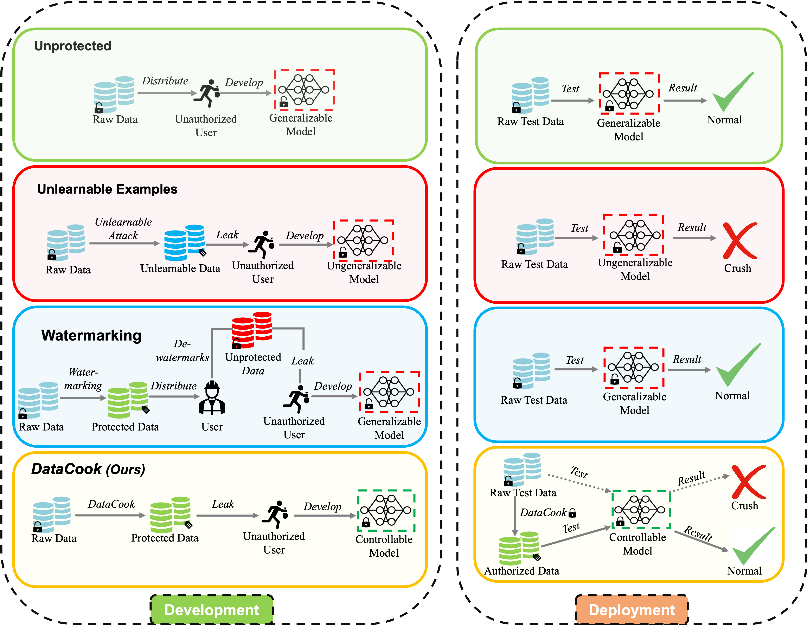

# DataCook
## Anti-adversarial fingerprints enable persistent copyright protection of healthcare data

An official implementation of the paper _Anti-adversarial fingerprints enable persistent copyright protection of healthcare data_. 

**The paper is still underreview!** The open-access version of the paper can be downloaded from [Arxiv](https://arxiv.org/abs/2403.17755). **Feel free to clone our full project, test, and even make improvements on your own.** 

### Abstract
<p align="justify">
The growing adoption of data-driven healthcare AI raises a key question: how can we protect sensitive medical data without hindering its use? Existing methods like encryption and watermarking only act before data distribution and cannot control models trained on protected data. We introduce <b>DataCook</b>, a deployment-phase framework that embeds imperceptible anti-adversarial fingerprints into medical data. These fingerprints enhance model confidence for authorized inputs while degrading performance for unauthorized ones, ensuring persistent and fine-grained copyright protection. DataCook supports 2D/3D and high-resolution medical imaging as well as non-image modalities, enabling secure sharing without sacrificing model utility.
</p>




---

## Table of Contents

- [Environment Setup](#environment-setup)
- [Dataset Preparation](#dataset-preparation)
- [How to Run Our Codes)](#how-to-run-our-codes)
- [Transfer Testing](#transfer-testing)
- [High-Resolution & 3D](#high-resolution--3d)
- [Baselines](#baselines)
- [Command-Line Arguments](#command-line-arguments)
- [Citation](#citation)
- [License](#license)
- [Contact](#contact)

---

## Environment Setup
```bash
# Create conda environment
conda create -n datacook python=3.8 -y
conda activate datacook

# Install required dependencies
pip install -r requirements.txt
```

---
## Dataset Preparation 
### 1. MedMNIST Datasets
We primarily use datasets from [MedMNIST](https://medmnist.com/ "https://medmnist.com/").
Please download them via the official Python API or manually place them under:
```bash
./data/MedMNIST/
```
Example:
```python
from medmnist import BloodMNIST
from torchvision import transforms

transform = transforms.Compose([transforms.ToTensor()])
train_dataset = BloodMNIST(split='train', transform=transform, download=True, root='./data/MedMNIST')
test_dataset = BloodMNIST(split='test', transform=transform, download=True, root='./data/MedMNIST')
```
---

### 2. Table Data
We also support **tabular datasets**. Please place them under:

```bash
./data/TableData/
```
| Dataset Name  | Download Link                       |
| ------------- | ----------------------------------- |
| Pima Indians Diabetes dataset  | [Using the ADAP Learning Algorithm to Forecast the Onset of Diabetes Mellitus](https://pmc.ncbi.nlm.nih.gov/articles/PMC2245318/) |
| Hepatitis C Prediction dataset | [UCI Machine Learning Repository](https://archive.ics.uci.edu/datasets) |
| Systemic Diseases dataset      | [UK biobank](https://pubmed.ncbi.nlm.nih.gov/25826379/) |

---

## How to Run Our Codes
**Example: Run DataCook on BloodMNIST (2D)**
```bash
# Step 1: Search perturbation noise
cd scripts/Datacook/2d/BloodMNIST
./search_perturbation_noise.sh

# Step 2: Train model with generated perturbations
cd scripts/Datacook/2d/BloodMNIST
./train.sh
```
You can follow the same format to add other datasets.

---
**Example: Run tabular datasets - systemic diseases.csv.**
```bash
# Step 1: pretrain model
cd TableData
python MLP.py

# Step 2: Generated perturbations and get result such as using datcook
python PrivacyAttacker.py --attack_type datacook
```

## Transfer Testing
To test transferability on another model (e.g., from ResNet-18 to ResNet-50),
modify the `model_name` argument in `train.sh`:
```bash
model_name=resnet50
```

---

## High-Resolution & 3D
For high-resolution and 3D datasets, see:
```bash
scripts/Datacook/high-resolution/
scripts/Datacook/3d/
```
---

## Baselines

We provide the following baselines in `scripts/`:

* Error-Minimum - [**EM**](https://arxiv.org/abs/2101.04898 "Unlearnable Examples: Making Personal Data Unexploitable") And modified verison of **EM** in our paper, called **EM-Pseudo**
* Adversarial Poison - [**ADV**](https://arxiv.org/abs/2106.10807 "Adversarial Examples Make Strong Poisons")
* Unlearnable Clusters - [**UC**](https://arxiv.org/abs/2301.01217 "Unlearnable Clusters: Towards Label-agnostic Unlearnable Examples")
* Synthetic Perturbations - [**LSP**](https://arxiv.org/abs/2111.00898 "https://arxiv.org/abs/2111.00898")

---

## Command-Line Arguments
All major hyperparameters can be set via command-line arguments in the provided `.sh` scripts.
Please refer to each `train.sh` or `search_perturbation_noise.sh` file for details.

---

## Citation
If you use this code, please cite the following:

> We adapted some codes from:
> * [Unlearnable Examples](https://github.com/HanxunH/Unlearnable-Examples)
> * [Unlearnable Clusters](https://github.com/jiamingzhang94/Unlearnable-Clusters)

## License
This project is licensed under the MIT License.

## Contact
For any questions or collaborations, please contact:
**Max Shang** – [loveligo97@gmail.com](loveligo97@gmail.com)


